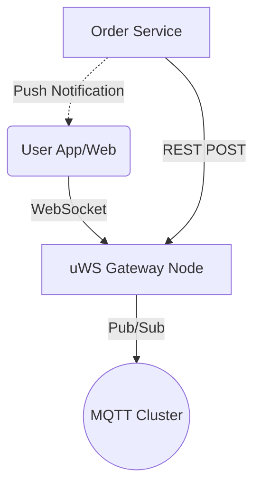

# 🚀 Scalable Real-Time Microservice (MQTT + uWebSockets.js)

A high-performance, real-time messaging gateway built to scale to **billions of users**, using the same architecture principles as **Facebook Messenger** and **WhatsApp**.

## 🏗 Architecture

This project implements the **"Edge Gateway" Pattern**:

- **Gateway Layer**: `uWebSockets.js` (C++)
  - Handles 100k+ concurrent WebSocket connections per node.
  - Authenticates users & terminates SSL.
- **Nervous System**: **MQTT** (Message Bus)
  - Routes messages between nodes.
  - Uses **Selective Subscriptions** (Node only listens to topics for _connected_ users).
- **Microservice Hook**: REST API
  - Allows external backend services (Order Service, Auth, etc.) to push real-time updates.



## ✨ Features

- **1:1 Chat**: Private messaging with real-time delivery.
- **Group Chat**: Join/Leave groups (`group/tech`, `page/news`).
- **Presence System**: Real-time Online/Offline status.
- **WebRTC Signaling**: Routing for Audio/Video Calls (Offer/Answer/ICE).
- **Internal Push API**: Send notifications from your other backends via HTTP.
- **Horizontally Scalable**: Deploy 10, 100, or 1000 nodes behind a Load Balancer.

## 🛠 Tech Stack

- **Runtime**: Node.js (TypeScript)
- **WebSockets**: `uWebSockets.js` (High-performance C++ binding)
- **Message Broker**: `Aedes` (Embedded for Dev) / **EMQX** (Production)
- **Protocol**: MQTT (Pub/Sub) + Custom JSON Protocol
- **Containerization**: Docker + Kubernetes

## 🚀 Getting Started

### Prerequisites

- Node.js v18+
- npm

### Installation

1.  Clone the repo:
    ```bash
    git clone https://github.com/sa3akash/MQTT-server.git
    cd MQTT-server
    ```
2.  Install dependencies:
    ```bash
    npm install
    ```

### Running Locally

Start the server (Gateway + Embedded Broker + Web Client):

```bash
npx ts-node src/index.ts
```

- **Web Client**: Open `http://localhost:4000`
- **WebSocket Server**: `ws://localhost:3000/ws`
- **Attributes**:
  - Port `3000`: WebSocket Gateway
  - Port `4000`: REST API & Static Files
  - Port `1883`: MQTT Broker

## 📡 API Documentation

### WebSocket Events (Client -> Server)

| Type           | Payload                                        | Description                  |
| :------------- | :--------------------------------------------- | :--------------------------- |
| `chat`         | `{ to: "userId", content: "..." }`             | Send DM                      |
| `join_channel` | `{ channel: "group/general" }`                 | Subscribe to Group           |
| `group_chat`   | `{ channel: "group/general", content: "..." }` | Send to Group                |
| `webrtc`       | `{ to: "userId", signal: "..." }`              | WebRTC Signal (Offer/Answer) |

### Internal Push API (Backend -> Server)

Send real-time updates from your other microservices.

**POST** `/internal/publish`

```bash
curl -X POST http://localhost:4000/internal/publish \
     -H "Content-Type: application/json" \
     -d '{
           "topic": "group/general",
           "message": "⚠️ Maintenance Mode Started"
         }'
```

## 📦 Deployment (Kubernetes)

1.  **Build Docker Image**:

    ```bash
    docker build -t my-socket-gateway .
    ```

2.  **Deploy to K8s**:
    ```bash
    kubectl apply -f k8s-deployment.yaml
    ```
    _This creates a scalable Deployment for the Gateway and a Service for the MQTT Broker._

## 📈 Scalability Strategy

To scale to **Billions**:

1.  **Replace LocalBroker**: Use a dedicated **EMQX** or **VerneMQ** cluster.
2.  **Scale Gateways**: Increase `replicas` in `k8s-deployment.yaml`.
3.  **Load Balancer**: Use an L7 Load Balancer (NGINX/HAProxy) to distribute WebSocket connections.

---

_Built for High Scale._
